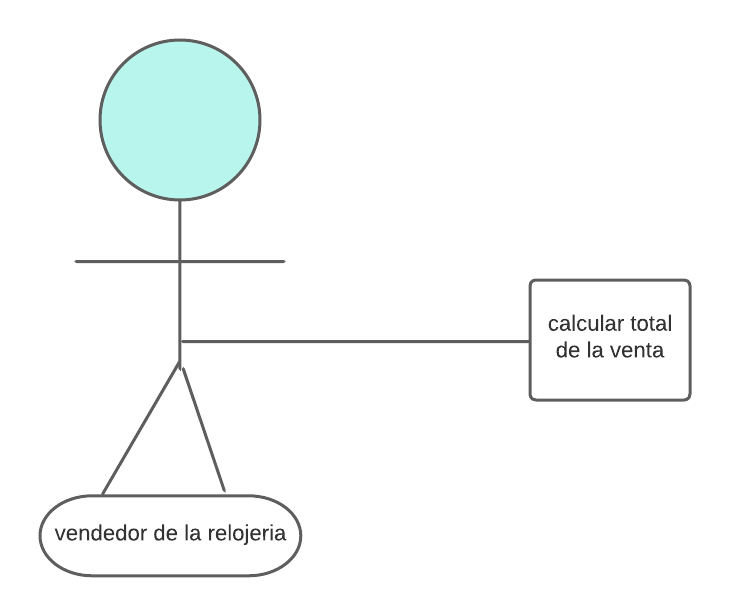
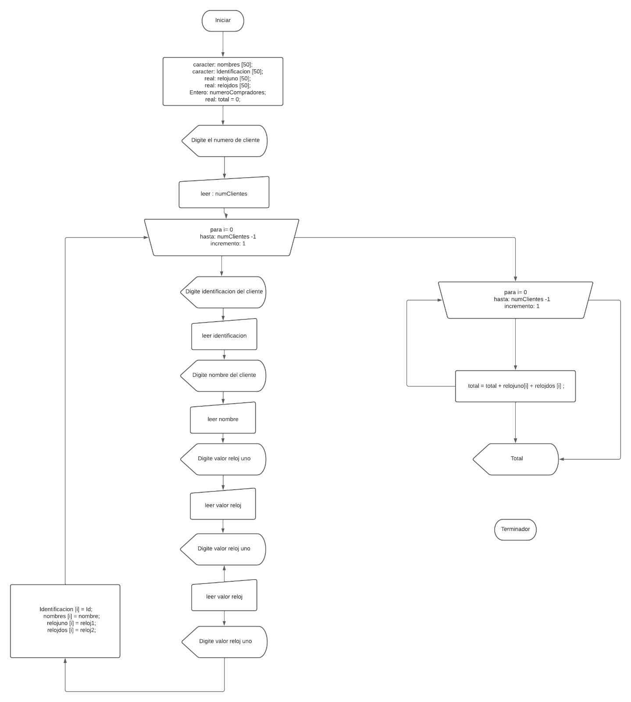

# Venta de relojes
En su labor como ingeniero de software debe crear una aplicacion que gestione las ventas dentro de una tienda de relojes esta debe sumar el total de las ventas y recibir datos de distintos compradores como lo son las identificaciones, nombres, y valores de distintos relojes.

Aclaraciones:
+ se supondra que la aplicacion solo tomara el total de las compras
+ para mantener l aimplicidad en el programa no se guardaran bases de datos
+ nose validan los datos ingresados

# Analisis del ejercicio
<u> Plantilla historia usuario </u>


<u>Aproximcion caso de uso</u>

Nombre: calcular total de un aventa de relojes
Actores: vendedore de una relojeria
Proposito: Guardar identificacion, nombre, curso y tres compras del cliente para calcular el total.
Curso normal de eventos:
1.El vendedor ingresa numero de clientes.
2.El vendedor digita la identificacion, nombre,  curso, reloj uno, reloj dos, reloj tres,  de cada cliente.
3.se calcula el total a partir de: reloj 1 + reloj 2 + reloj 3.
4.Se muestra el total de todos los clientes segun la suma de cada una de las compras.


<u>Aproximacion diagrama de flujo</u>



<u>Aproximacion seudocodigo</u>

```
ALGORITMO VentaRelojes
 // Declaración de variables
 DIMENSION nombres[50]
 DIMENSION Identificacion[50]
 DIMENSION relojuno[50]
 DIMENSION relojdos[50]
 numeroCompradores <- 0
 nombre <- " "
 Id <- " "
 real: reloj1, reloj2, total;
 
 // Entrada de datos
 ESCRIBIR "Digite la cantidad de compradores: "
 LEER numeroCompradores
 
 // Ciclo para ingresar datos de los compradores
 PARA i <- 0 HASTA numeroCompradores - 1 CON PASO 1
 ESCRIBIR "Digite su número de identificación: "
 LEER Id
 ESCRIBIR "Digite su nombre: "
 LEER nombre
 ESCRIBIR "Digite el valor del primer reloj: "
 LEER reloj1
 ESCRIBIR "Digite el valor del segundo reloj: "
 LEER reloj2

Identificacion[i] <- Id
 nombres[i] <- nombre
 relojuno[i] <- reloj1
 relojdos[i] <- reloj2
 FIN PARA
 
 // Calcular el total de la compra
 PARA i <- 0 HASTA numeroCompradores - 1 CON PASO 1
 total <- total + relojuno[i] + relojdos[i]
 FIN PARA
 
 // Mostrar el total de la compra
 ESCRIBIR "EL TOTAL DE SU COMPRA ES: " + total
FIN ALGORITMO
```